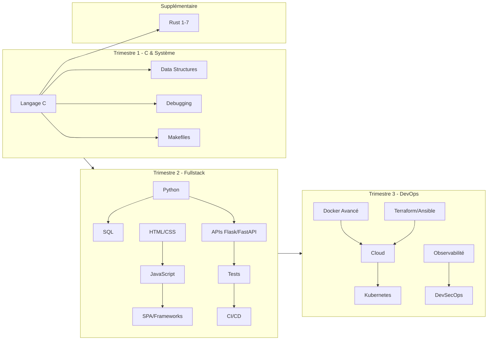

# Index - Cours de Programmation

> [!info] Guide complet
> Ce coffre contient des cours complets pour apprendre la programmation depuis zéro. Chaque note est conçue pour qu'un novice puisse, après lecture, écrire et mettre en pratique toutes les connaissances abordées.
> 
> **85 notes** | **~87 000 lignes** | Tout en français

---

## Trimestre 1 — Fondations (C, Système, Outils)

### Langage C

| # | Cours | Description |
|---|-------|-------------|
| 0b | [[00b - Le Preprocesseur C]] | #define, macros, header guards, compilation conditionnelle |
| 1 | [[01 - Introduction au C et Compilation]] | Bases du C, compilation, GCC, types, putchar, printf, contrôle de flux |
| 2 | [[02 - Bases Numeriques]] | Binaire, décimal, hexadécimal, conversions, bitwise, endianness |
| 3 | [[03 - Structures et Typedef]] | Structs, typedef, layout mémoire, padding |
| 3b | [[03b - Les Pointeurs]] | Pointeurs, &, *, arithmétique, arrays, double pointeurs, const |
| 3c | [[03c - Chaines de Caracteres]] | strlen, strcpy, strcmp, strcat, strtok, ctype.h |
| 4 | [[04 - Pointeurs et Memoire]] | malloc, calloc, realloc, free, stack vs heap |
| 5 | [[05 - Pointeurs de Fonctions]] | Function pointers, callbacks, dispatch tables |
| 6 | [[06 - Fonctions Variadiques]] | va_list, va_start, va_arg, va_end |
| 7 | [[07 - Recursion]] | Cas de base, call stack, factorielle, Fibonacci |
| 8 | [[08 - Arguments Ligne de Commande]] | argc, argv, parsing, conversions |
| 9 | [[09 - File IO et Appels Systeme]] | open, close, read, write, file descriptors |
| 10 | [[10 - Projet Printf]] | Architecture _printf, dispatch table, specifiers |
| 11 | [[11 - Makefiles]] | Make, compilation incrémentale, variables, règles |
| 12 | [[12 - Projet Simple Shell]] | fork/execve/wait, PATH, builtins, REPL complet |

### Structures de Données & Algorithmes

| # | Cours | Description |
|---|-------|-------------|
| 1 | [[01 - Listes Chainees]] | Singly linked lists, nœuds, parcours, insertion |
| 2 | [[02 - Listes Doublement Chainees]] | Doubly linked lists, prev/next, bidirectionnel |
| 3 | [[03 - Tables de Hachage]] | Hash tables, djb2, collisions, O(1) |
| 4 | [[04 - Arbres Binaires]] | Binary trees, BST, parcours, hauteur |
| 5 | [[05 - Tri et Complexite Algorithmique]] | Big O, Bubble/Insertion/Selection/Quick/Merge Sort |

### Outils de Débogage

| # | Cours | Description |
|---|-------|-------------|
| 1 | [[01 - GDB]] | Breakpoints, step, inspect, backtrace, TUI |
| 2 | [[02 - Valgrind]] | Fuites mémoire, accès invalides, bonnes pratiques |

### Shell & Terminal

| # | Cours | Description |
|---|-------|-------------|
| 1 | [[01 - Shell et Commandes Linux]] | Bash, navigation, grep, redirections, processus |
| 2 | [[02 - Shell Scripting]] | Scripts bash, boucles, conditions, fonctions |
| 3 | [[02 - Les Terminaux Guide Complet]] | Bash, Zsh, CMD, PowerShell, Git Bash, WSL |
| 4 | [[01 - Archives et Compression]] | ZIP, TAR, compression, formats d'archives |

### Git, DevOps & Sécurité

| # | Cours | Description |
|---|-------|-------------|
| 1 | [[01 - Git et GitHub]] | Workflow, branches, merge, conflits, GitHub Flow |
| 2 | [[01 - Docker]] | Conteneurs, images, Dockerfile, Docker Compose |
| 3 | [[01 - Securite Memoire en C]] | Buffer overflow, dangling pointers, memory leaks |

---

## Trimestre 2 — Fullstack & Web

### Python

| # | Cours | Description |
|---|-------|-------------|
| 1 | [[01 - Introduction a Python]] | Interpréteur, types, f-strings, fonctions, comparaisons C |
| 2 | [[02 - Structures de Donnees Python]] | Listes, tuples, dicts, sets, comprehensions |
| 3 | [[03 - POO en Python]] | Classes, héritage, polymorphisme, dunder methods |
| 4 | [[04 - POO Avancee]] | Décorateurs, ABC, design patterns, SOLID |
| 5 | [[05 - Gestion des Erreurs et Fichiers]] | try/except, context managers, JSON, CSV, pathlib |
| 6 | [[06 - Modules Packages et Venv]] | import, pip, venv, structure projet |
| 7 | [[07 - Python Async et Concurrence]] | Threading, multiprocessing, asyncio, GIL |
| 8 | [[08 - APIs REST avec Flask]] | HTTP, routes, CRUD API, blueprints |
| 9 | [[09 - APIs REST avec FastAPI]] | Pydantic, Swagger, async, comparaison Flask |
| 10 | [[10 - Python et Bases de Donnees]] | SQLAlchemy ORM, models, Alembic migrations |
| 11 | [[11 - Projet HBnB]] | **Projet T2** : clone AirBnB, architecture, API, auth, frontend |

### SQL

| # | Cours | Description |
|---|-------|-------------|
| 1 | [[01 - Introduction au SQL]] | SGBD, CREATE, SELECT, WHERE, ORDER BY |
| 2 | [[02 - Requetes Avancees SQL]] | JOIN, sous-requêtes, GROUP BY, window functions |
| 3 | [[03 - Conception de Bases de Donnees]] | Normalisation, ER diagrams, clés, indexes |
| 4 | [[04 - SQL Avance et Administration]] | Transactions ACID, vues, procédures, injections SQL |

### Web Frontend

| # | Cours | Description |
|---|-------|-------------|
| 1 | [[01 - HTML Fondamentaux]] | Sémantique, formulaires, accessibilité |
| 2 | [[02 - CSS Fondamentaux]] | Box model, flexbox, grid, responsive design |
| 3 | [[03 - CSS Avance]] | Animations, BEM, Tailwind, dark mode |
| 4 | [[04 - Projet Web Statique]] | Portfolio HTML/CSS complet, GitHub Pages |

### JavaScript

| # | Cours | Description |
|---|-------|-------------|
| 1 | [[01 - Introduction a JavaScript]] | let/const, types, scope, closures, == vs === |
| 2 | [[02 - JavaScript DOM et Evenements]] | querySelector, events, délégation, localStorage |
| 3 | [[03 - JavaScript Asynchrone]] | Promises, async/await, fetch API, event loop |
| 4 | [[04 - JavaScript Moderne ES6+]] | Destructuring, modules, classes, Map/Set |
| 5 | [[05 - SPA et Frameworks Introduction]] | SPA vs MPA, React/Vue/Svelte, state management |
| 6 | [[06 - Projet JavaScript Interactif]] | TODO app complète, MVC, drag & drop |

### Tests & Qualité de Code

| # | Cours | Description |
|---|-------|-------------|
| 1 | [[01 - Tests Unitaires et TDD]] | pytest, fixtures, mocking, TDD red/green/refactor |
| 2 | [[02 - Tests Integration et E2E]] | Test client, Selenium, Playwright, couverture |
| 3 | [[03 - Linting Formatting et Code Quality]] | pylint, black, ESLint, pre-commit hooks |

### DevOps & CI/CD

| # | Cours | Description |
|---|-------|-------------|
| 1 | [[02 - Docker Avance]] | Multi-stage builds, networks, secrets, optimisation |
| 2 | [[03 - Docker Compose en Pratique]] | Services multiples, .env, dev vs prod |
| 3 | [[04 - CI-CD avec GitHub Actions]] | Workflows YAML, matrix, artifacts, deploy |

### Sécurité Web

| # | Cours | Description |
|---|-------|-------------|
| 1 | [[02 - Securite Web OWASP]] | Top 10 OWASP, XSS, CSRF, injection, HTTPS, CORS |

### IA pour le Développement — Trimestre Complet

| # | Cours | Description |
|---|-------|-------------|
| 1 | [[01 - Panorama des IA pour Developpeurs]] | Toutes les familles de modèles, benchmarks, cloud vs local, tableau comparatif |
| 2 | [[02 - Comprendre les LLMs et les Tokens]] | Architecture Transformer, tokenisation, context window, quantisation, hallucinations |
| 3 | [[03 - Prompt Engineering pour le Code]] | Techniques zero/few-shot, chain-of-thought, templates debug/refactor/tests, hack 95% |
| 4 | [[04 - Claude et Claude Code Maitrise Avancee]] | Installation, CLAUDE.md, hooks, sub-agents, Advisor Tool, MCP, prompt cache, Ollama |
| 5 | [[05 - ChatGPT Codex et GitHub Copilot]] | GPT-4o, o1/o3, GitHub Copilot setup, API OpenAI, Canvas, Code Interpreter |
| 6 | [[06 - Gemini Mistral et Alternatives Cloud]] | Gemini 2.5 Pro, Gemini CLI, Codestral, DeepSeek, Qwen, Llama, accès gratuits |
| 7 | [[07 - Integrations IDE et Extensions]] | VS Code (Copilot, Continue.dev, Cline), Cursor, Windsurf, JetBrains AI |
| 8 | [[08 - OpenCode et CLI Alternatifs]] | OpenCode, Aider (auto-commits), Goose, Amp, usage avec Ollama |
| 9 | [[09 - IA Locale avec Ollama]] | Installation, Qwen/DeepSeek/Llama locaux, API compatible OpenAI, serveur équipe |
| 10 | [[10 - LM Studio et Hardware Local]] | Interface GUI, quantisation Q4/Q8, GPU vs CPU, requirements hardware, Jan/LocalAI |
| 11 | [[11 - IA Confidentialite et Entreprise]] | RGPD, politiques providers, Azure/Vertex/Bedrock, auto-hébergement, vLLM, Tabby |
| 12 | [[12 - Strategies Multi-Modeles et Workflows]] | Matrice coût/qualité, routing des tâches, stacks par profil, plan d'action 4 semaines |

---

## Trimestre 3 — DevOps & Cloud

### Infrastructure as Code

| # | Cours | Description |
|---|-------|-------------|
| 1 | [[05 - Infrastructure as Code Terraform]] | HCL, providers, state, modules |
| 2 | [[06 - Automatisation avec Ansible]] | Playbooks, inventory, roles, Jinja2 |

### Cloud

| # | Cours | Description |
|---|-------|-------------|
| 1 | [[01 - Introduction au Cloud]] | IaaS/PaaS/SaaS, AWS/GCP/Azure, CLI |
| 2 | [[02 - Services Cloud Essentiels]] | Compute, Storage, IAM, VPC |
| 3 | [[03 - Deploiement Cloud et Conteneurs]] | ECS/GKE, registres, load balancers |
| 4 | [[04 - Kubernetes Introduction]] | Pods, services, deployments, kubectl |

### Réseaux

| # | Cours | Description |
|---|-------|-------------|
| 1 | [[01 - Fondamentaux Reseaux]] | OSI/TCP-IP, DNS, sous-réseaux, outils |
| 2 | [[02 - HTTP et Protocoles Web]] | HTTP/1-2-3, TLS, WebSocket, REST vs GraphQL |
| 3 | [[03 - Securite Reseau]] | Firewalls, VPN, SSH, certificates |

### Observabilité & Monitoring

| # | Cours | Description |
|---|-------|-------------|
| 1 | [[01 - Logs et Journalisation]] | Niveaux, logging Python, ELK stack |
| 2 | [[02 - Metriques et Monitoring]] | Prometheus, Grafana, SLI/SLO/SLA |
| 3 | [[03 - Tracing et Debugging Distribue]] | OpenTelemetry, correlation IDs |

### DevSecOps

| # | Cours | Description |
|---|-------|-------------|
| 1 | [[07 - DevSecOps]] | Shift-left, SAST/DAST, secrets management |
| 2 | [[08 - Projet Capstone DevOps]] | **Projet T3** : app complète, CI/CD, cloud, monitoring |

---

## Supplémentaire — Rust

| # | Cours | Description |
|---|-------|-------------|
| 1 | [[01 - Introduction a Rust]] | cargo, types, mutabilité, comparaisons C |
| 2 | [[02 - Ownership et Borrowing]] | Propriété, références, lifetimes |
| 3 | [[03 - Structs Enums et Pattern Matching]] | Option, Result, match, if let |
| 4 | [[04 - Gestion des Erreurs en Rust]] | Result, ?, anyhow, thiserror |
| 5 | [[05 - Collections et Iterateurs]] | Vec, HashMap, closures, map/filter/fold |
| 6 | [[06 - Traits et Generiques]] | Traits, impl, generics, dyn Trait |
| 7 | [[07 - Projet Rust CLI]] | minigrep complet, clap, tests, publication |

---

## Parcours recommandé

> [!tip] Planning semaine par semaine
> **T1 — Semaines 1-9** : C → Pointeurs → Structures → Mémoire → Data Structures → Debugging
> **T2 — Semaines 10-18** : Python → SQL → HTML/CSS → JavaScript → APIs → Tests → CI/CD
> **T3 — Semaines 19-27** : Docker avancé → Cloud → Réseaux → Kubernetes → Observabilité → DevSecOps
> **En continu** : Git, Sécurité, Shell, Rust, IA

---

*Notes générées à partir des cheatsheets Holberton School, de 43 discussions Gemini, et enrichies avec des explications approfondies.*
