# UML Fondamentaux et Diagrammes

> [!info] Pourquoi modéliser avant de coder ?
> Un plan d'architecte avant de construire un bâtiment. UML est le langage universel pour décrire la structure et le comportement d'un système logiciel — avant que le code n'existe, pendant sa conception, et comme documentation vivante.

## Table des matières
1. [[#Introduction à UML]]
2. [[#Diagramme de Classes]]
3. [[#Diagramme de Séquence]]
4. [[#Diagramme de Cas d'Utilisation]]
5. [[#Diagramme d'Activité]]
6. [[#Diagramme d'État]]
7. [[#Diagramme de Composants]]
8. [[#Diagramme de Déploiement]]
9. [[#PlantUML — Syntaxe Complète]]
10. [[#Mermaid dans Obsidian]]
11. [[#Quand utiliser quel diagramme]]
12. [[#Exercices Pratiques]]

---

## Introduction à UML

### Qu'est-ce qu'UML ?

**UML** (Unified Modeling Language) est un langage de modélisation standardisé par l'OMG (Object Management Group) en 1997. Il fournit une notation graphique commune pour décrire des systèmes logiciels orientés objet.

> [!tip] L'analogie architecturale
> Un architecte produit des plans (façade, coupe, électricité, plomberie) avant de construire. Chaque plan cible un public différent (client, maçon, électricien). UML fonctionne de la même manière : différents diagrammes pour différentes perspectives du même système.

### UML 1.x vs UML 2.x

| Aspect | UML 1.x (1997–2001) | UML 2.x (2005–aujourd'hui) |
|--------|---------------------|---------------------------|
| Diagrammes | 9 types | 14 types |
| Séquence | Limité | Fragments (alt/loop/par) |
| Composants | Basique | Interfaces fournies/requises |
| Activité | Simple flowchart | BPMN-like avec swim lanes |
| État | Basique | États composites, historique |
| Adoption | Largement remplacé | Standard actuel |

### Les 14 types de diagrammes UML 2.x

```
Diagrammes UML 2.x
├── Diagrammes Structurels (7)
│   ├── Classes ← le plus important
│   ├── Objets
│   ├── Composants
│   ├── Déploiement
│   ├── Packages
│   ├── Structure Composite
│   └── Profils
└── Diagrammes Comportementaux (7)
    ├── Cas d'Utilisation
    ├── Activité
    ├── État (Machine à états)
    ├── Séquence
    ├── Communication
    ├── Temporisation
    └── Vue d'Ensemble des Interactions
```

### Outils

| Outil | Type | Gratuit | PlantUML | Mermaid | Collaboratif |
|-------|------|---------|----------|---------|--------------|
| **PlantUML** | Code → Diagramme | Oui | Natif | Non | Via export |
| **Mermaid** | Code → Diagramme | Oui | Non | Natif | Via intégrations |
| **draw.io / diagrams.net** | GUI | Oui | Import | Import | Oui |
| **Lucidchart** | GUI | Freemium | Import | Non | Oui |
| **StarUML** | GUI | Freemium | Non | Non | Non |
| **Visual Paradigm** | GUI | Freemium | Non | Non | Oui |
| **Obsidian** | Notes | Oui | Plugin | Natif | Non |

> [!tip] Recommandation
> Pour des cours et documentation : **Mermaid** (natif Obsidian) + **PlantUML** (plugin Obsidian). Pour du travail en équipe : **draw.io** (gratuit, exportable, intégré à Confluence/GitHub).

---

## Diagramme de Classes

Le diagramme de classes est le **cœur d'UML** — il modélise la structure statique du système : les entités, leurs attributs, leurs méthodes et leurs relations.

### Anatomie d'une classe

```
┌─────────────────────────┐
│        NomClasse        │  ← Compartiment Nom (gras, centré)
├─────────────────────────┤
│  - attributPrivé: Type  │  ← Compartiment Attributs
│  # attributProtégé: int │
│  + attributPublic: str  │
│  ~ attributPackage: bool│
├─────────────────────────┤
│  + méthodePublique(): void │  ← Compartiment Méthodes
│  - méthodePrivée(): int    │
│  # méthodeProtégée(): str  │
└─────────────────────────┘
```

### Visibilité des membres

| Symbole | Visibilité | Équivalent Python | Équivalent Java |
|---------|-----------|-------------------|-----------------|
| `+` | Public | (rien) | `public` |
| `-` | Private | `__` (name mangling) | `private` |
| `#` | Protected | `_` (convention) | `protected` |
| `~` | Package/Internal | N/A | (défaut, package-private) |

### Exemple complet : Système de bibliothèque

#### Code Python correspondant

```python
from abc import ABC, abstractmethod
from datetime import datetime
from typing import Optional

class Personne(ABC):
    """Classe abstraite — ne peut pas être instanciée directement."""
    
    def __init__(self, nom: str, email: str):
        self._nom = nom          # protected
        self.__email = email     # private
    
    @property
    def nom(self) -> str:
        return self._nom
    
    @abstractmethod
    def identifier(self) -> str:
        pass

class Membre(Personne):
    """Héritage de Personne."""
    
    def __init__(self, nom: str, email: str, numero_carte: str):
        super().__init__(nom, email)
        self.__numero_carte = numero_carte
        self.__emprunts: list['Emprunt'] = []  # composition
    
    def identifier(self) -> str:
        return f"Membre #{self.__numero_carte}"
    
    def emprunter(self, livre: 'Livre') -> 'Emprunt':
        emprunt = Emprunt(self, livre)
        self.__emprunts.append(emprunt)
        return emprunt

class Livre:
    """Agrégation avec Auteur."""
    
    def __init__(self, titre: str, isbn: str, auteur: 'Auteur'):
        self.titre = titre
        self.__isbn = isbn
        self.auteur = auteur      # association (agrégation)
        self.__disponible = True
    
    @property
    def disponible(self) -> bool:
        return self.__disponible

class Auteur(Personne):
    def __init__(self, nom: str, email: str):
        super().__init__(nom, email)
        self.__livres: list[Livre] = []
    
    def identifier(self) -> str:
        return f"Auteur: {self._nom}"

class Emprunt:
    """Composition — l'emprunt appartient entièrement au membre."""
    
    def __init__(self, membre: Membre, livre: Livre):
        self.__membre = membre
        self.__livre = livre
        self.__date_debut = datetime.now()
        self.__date_retour: Optional[datetime] = None
    
    def retourner(self):
        self.__date_retour = datetime.now()
```

#### Code Java correspondant

```java
import java.time.LocalDateTime;
import java.util.ArrayList;
import java.util.List;

// Classe abstraite
public abstract class Personne {
    protected String nom;      // protected
    private String email;      // private
    
    public Personne(String nom, String email) {
        this.nom = nom;
        this.email = email;
    }
    
    public String getNom() { return nom; }
    public abstract String identifier();
}

// Héritage (généralisation)
public class Membre extends Personne {
    private String numeroCarte;
    private List<Emprunt> emprunts = new ArrayList<>();  // composition
    
    public Membre(String nom, String email, String numeroCarte) {
        super(nom, email);
        this.numeroCarte = numeroCarte;
    }
    
    @Override
    public String identifier() {
        return "Membre #" + numeroCarte;
    }
    
    public Emprunt emprunter(Livre livre) {
        Emprunt emprunt = new Emprunt(this, livre);
        emprunts.add(emprunt);
        return emprunt;
    }
}

// Interface (réalisation)
public interface Cataloguable {
    String getReference();
    boolean estDisponible();
}

public class Livre implements Cataloguable {
    private String titre;
    private String isbn;
    private Auteur auteur;    // association (agrégation)
    private boolean disponible = true;
    
    @Override
    public String getReference() { return isbn; }
    
    @Override
    public boolean estDisponible() { return disponible; }
}
```

### Relations entre classes

#### 1. Association (lien simple)
Une classe **connaît** une autre. Relation faible, sans ownership.

```
Etudiant ────────── Cours
          0..* inscrits à 0..*
```

#### 2. Agrégation (« a un », tout-partie faible)
La partie **peut exister** sans le tout. Représentée par un losange vide.

```
Departement ◇────── Employe
             1    0..*
```
Si le département est dissous, les employés continuent d'exister.

#### 3. Composition (« contient », tout-partie forte)
La partie **ne peut pas exister** sans le tout. Représentée par un losange plein.

```
Commande ◆────── LigneCommande
          1    1..*
```
Si la commande est supprimée, les lignes sont supprimées.

#### 4. Héritage / Généralisation
Relation **est-un**. Flèche à tête fermée vide vers la superclasse.

```
Animal ◁────── Chien
       ◁────── Chat
```

#### 5. Réalisation / Interface
Une classe **implémente** une interface. Flèche en pointillés à tête fermée vide.

```
<<interface>>
Payable ◁- - - CarteBancaire
        ◁- - - Virement
```

#### 6. Dépendance
Une classe **utilise** une autre temporairement. Flèche en pointillés simple.

```
CommandeService - - - > EmailService
```

### Tableau des multiplicités

| Notation | Signification |
|----------|---------------|
| `1` | Exactement un |
| `0..1` | Zéro ou un (optionnel) |
| `*` ou `0..*` | Zéro ou plusieurs |
| `1..*` | Un ou plusieurs |
| `3` | Exactement trois |
| `2..5` | Entre deux et cinq |

---

## Diagramme de Séquence

Modélise les **interactions dans le temps** entre objets ou composants pour un scénario donné.

### Éléments clés

| Élément | Représentation | Description |
|---------|----------------|-------------|
| Acteur | Bonhomme | Utilisateur externe |
| Objet | Rectangle + ligne de vie | Participant |
| Ligne de vie | Ligne verticale pointillée | Existence dans le temps |
| Boîte d'activation | Rectangle sur ligne de vie | Période d'activité |
| Message synchrone | Flèche pleine → | Attend la réponse |
| Message asynchrone | Flèche ouverte → | N'attend pas |
| Retour | Flèche pointillée ← | Valeur de retour |
| Création | → «create» | Instanciation |
| Destruction | → «destroy» + X | Fin de vie |

### Fragments combinés

| Fragment | Signification |
|----------|---------------|
| `alt` | Alternative (if/else) |
| `opt` | Optionnel (if sans else) |
| `loop` | Boucle |
| `par` | Parallèle |
| `ref` | Référence vers un autre diagramme |
| `break` | Interruption |
| `critical` | Section critique |

### Exemple : Flux de login

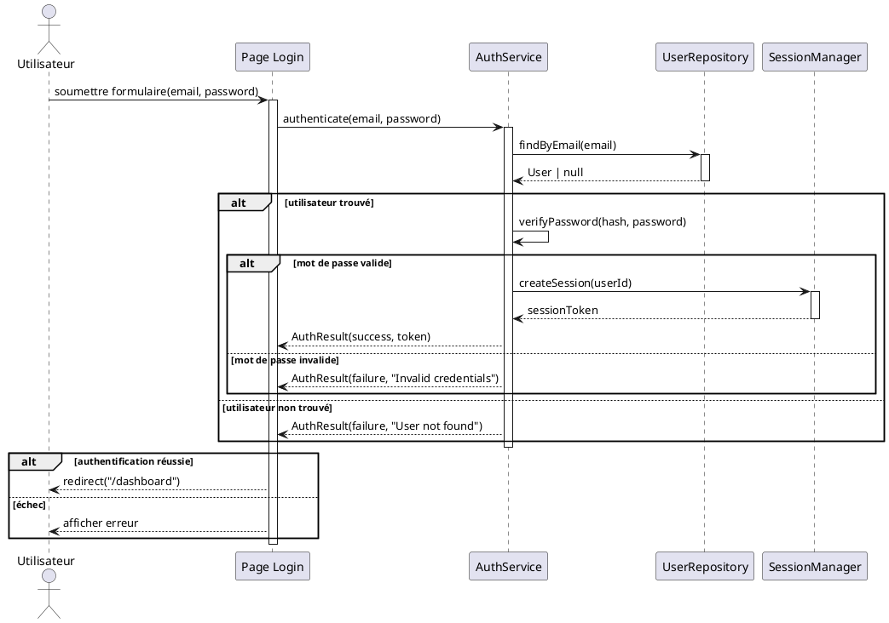

### Exemple : Appel API REST

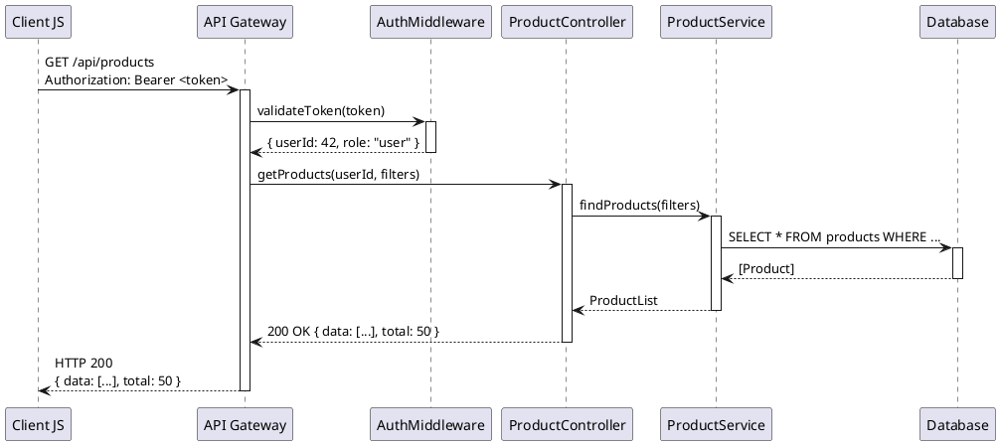

---

## Diagramme de Cas d'Utilisation

Modélise les **fonctionnalités du système** du point de vue des utilisateurs. Répond à la question : **"Que fait le système ?"**

### Éléments

| Élément | Représentation | Description |
|---------|----------------|-------------|
| Acteur | Bonhomme | Entité externe (humain, système) |
| Cas d'utilisation | Ellipse | Fonctionnalité du système |
| Frontière système | Rectangle | Limite du système modélisé |
| Association | Ligne | Acteur participe au cas |
| `<<include>>` | Flèche pointillée | Toujours inclus |
| `<<extend>>` | Flèche pointillée | Conditionnellement ajouté |
| Généralisation | Flèche | Spécialisation d'acteur ou cas |

### Différence include vs extend

> [!warning] Include vs Extend — source de confusion fréquente
> - **`<<include>>`** : le cas inclus est **toujours** exécuté. C'est une factorisation (DRY). Ex : "S'authentifier" est inclus dans tout cas nécessitant un login.
> - **`<<extend>>`** : le cas étendant est **optionnel et conditionnel**. Ex : "Ajouter une note" peut étendre "Passer une commande" seulement si le client le souhaite.

### Exemple : Système de bibliothèque

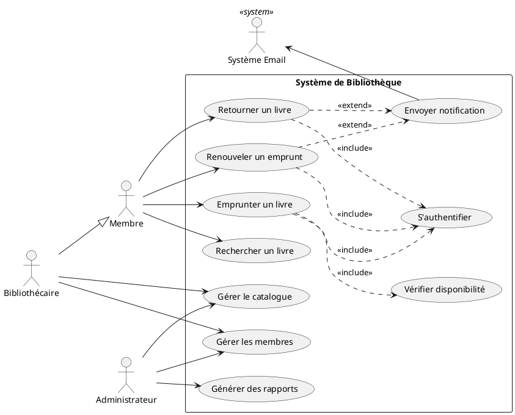

---

## Diagramme d'Activité

Modélise les **flux de travail et algorithmes**. Proche des flowcharts mais avec des concepts OO (swim lanes, fork/join pour la concurrence).

### Éléments clés

| Élément | Représentation | Description |
|---------|----------------|-------------|
| Nœud initial | Cercle noir plein | Point de départ |
| Nœud final | Cercle noir dans cercle | Point d'arrivée |
| Action | Rectangle arrondi | Tâche élémentaire |
| Décision | Losange | Branchement conditionnel |
| Fork | Barre horizontale → multiple | Parallélisation |
| Join | Multiple → barre horizontale | Synchronisation |
| Swim Lane | Colonne/rangée | Responsabilité d'un acteur |

### Exemple : Processus commande e-commerce

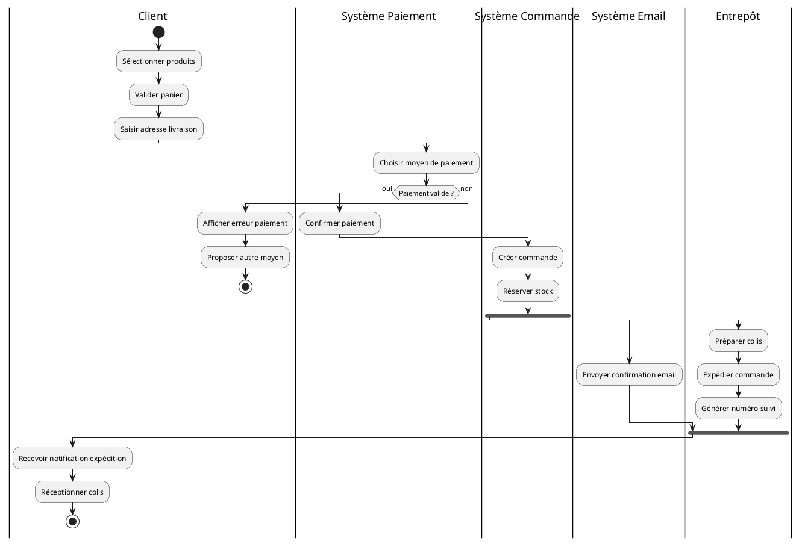

---

## Diagramme d'État

Modélise le **cycle de vie d'un objet** — comment il change d'état en réponse à des événements.

### Éléments

| Élément | Description |
|---------|-------------|
| État initial | Cercle plein |
| État | Rectangle arrondi avec nom |
| Transition | Flèche avec `événement [garde] / action` |
| État final | Cercle plein dans cercle |
| État composite | État contenant d'autres états |
| Historique | `H` dans cercle (mémorise le dernier état) |

### Syntaxe des transitions

```
événement [condition_garde] / action_exécutée
```

### Exemple : Cycle de vie d'une commande

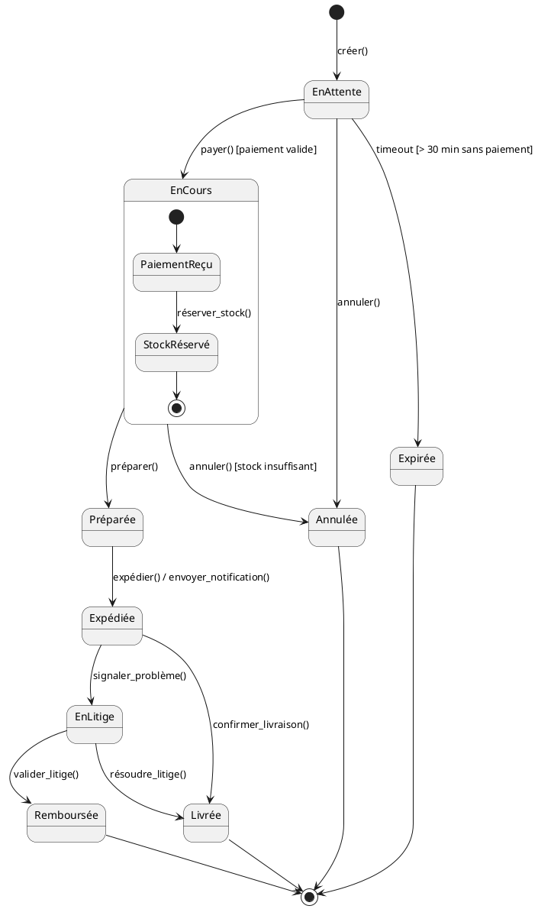

---

## Diagramme de Composants

Modélise la **structure physique** du système — les modules, bibliothèques, services et leurs interfaces.

### Éléments

| Élément | Description |
|---------|-------------|
| Composant | Rectangle avec icône composant ou `<<component>>` |
| Interface fournie | Cercle (lollipop) — ce que le composant offre |
| Interface requise | Demi-cercle (socket) — ce que le composant consomme |
| Port | Carré sur le bord d'un composant |
| Connecteur | Ligne reliant lollipop et socket |
| Artefact | Fichier physique (`.jar`, `.exe`, `.dll`) |

### Exemple : Architecture Microservices

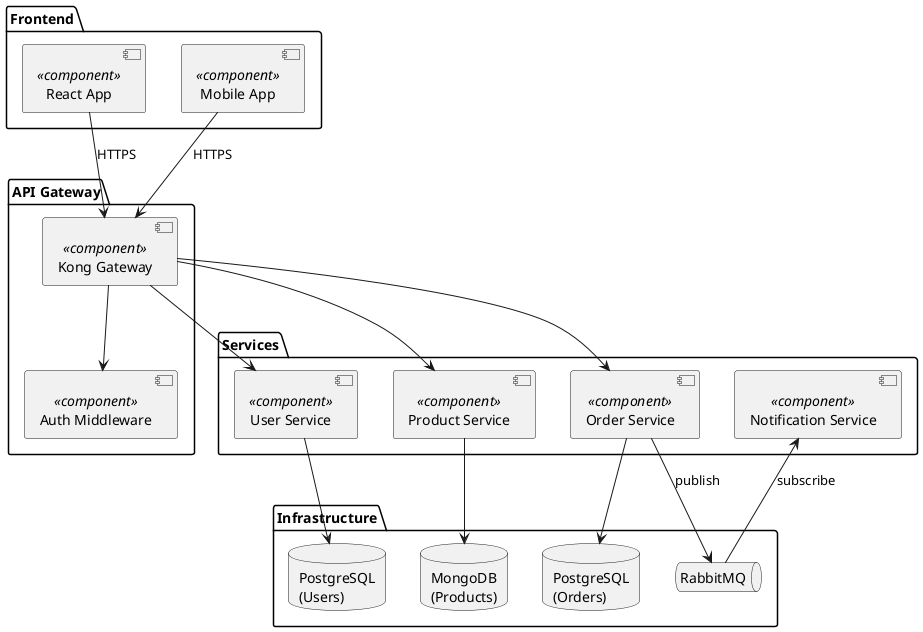

---

## Diagramme de Déploiement

Modélise l'**infrastructure physique** — sur quelles machines tournent quels logiciels.

### Éléments

| Élément | Description |
|---------|-------------|
| Nœud | Ressource physique ou virtuelle (serveur, VM, conteneur) |
| Artefact | Fichier déployable (`.war`, image Docker, `.exe`) |
| Communication | Lien entre nœuds avec protocole |

### Exemple : Cloud Deployment

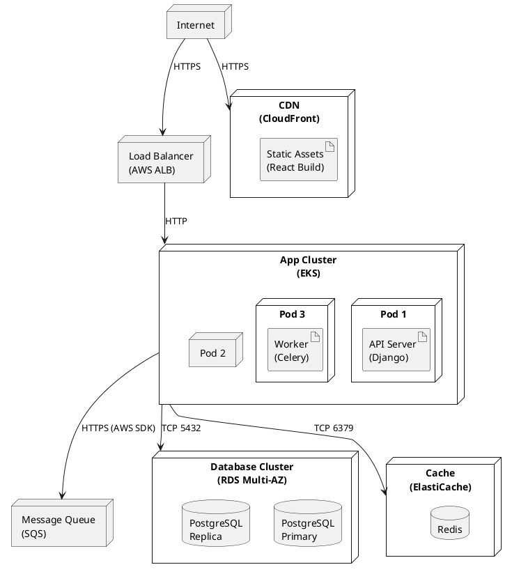

---

## PlantUML — Syntaxe Complète

> [!info] PlantUML dans Obsidian
> Installer le plugin communautaire **PlantUML** dans Obsidian. Utiliser le bloc ` ```plantuml ` pour les diagrammes.

### Diagramme de classes PlantUML

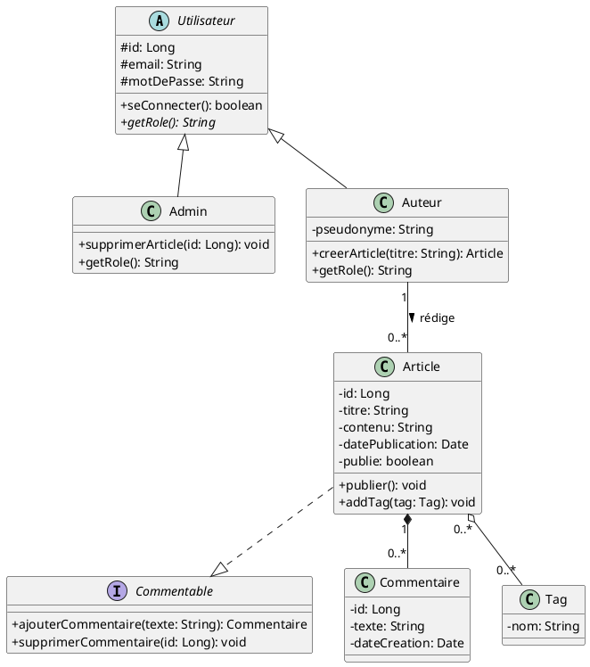

### Diagramme de séquence PlantUML

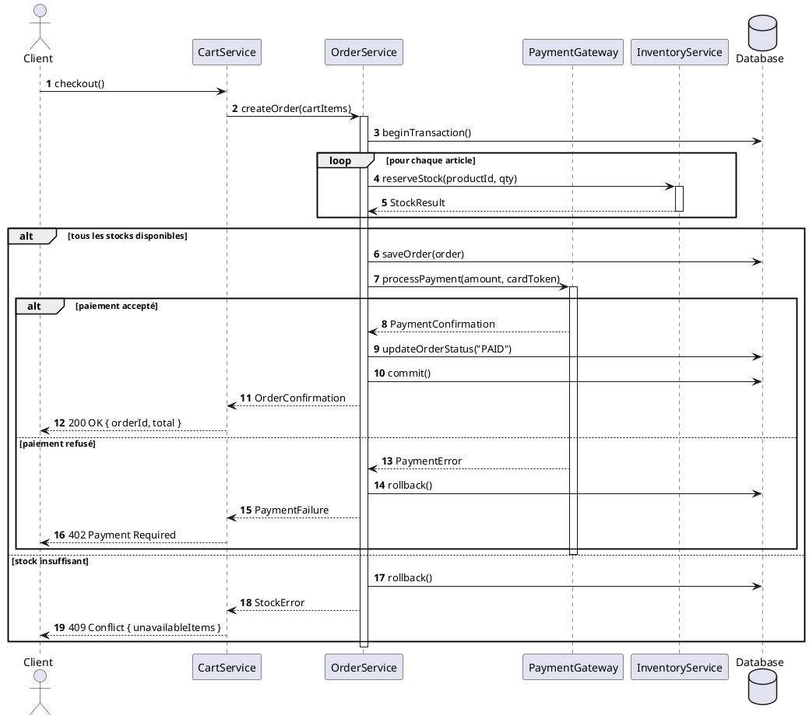

---

## Mermaid dans Obsidian

Obsidian supporte **nativement** Mermaid sans plugin supplémentaire. Utiliser le bloc ` ```mermaid `.

### Diagramme de classes Mermaid

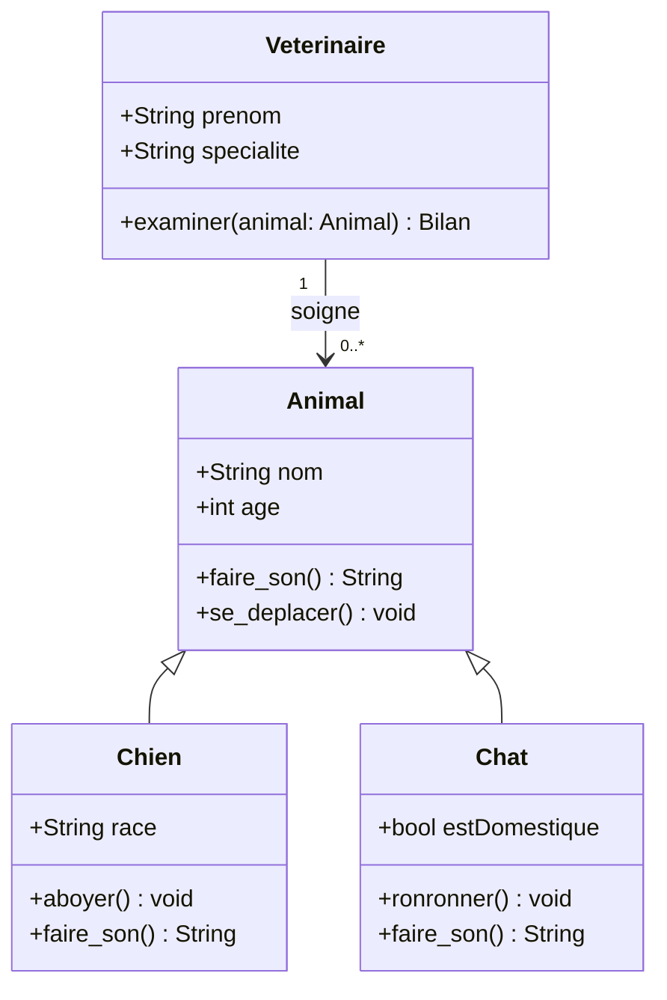

### Diagramme de séquence Mermaid

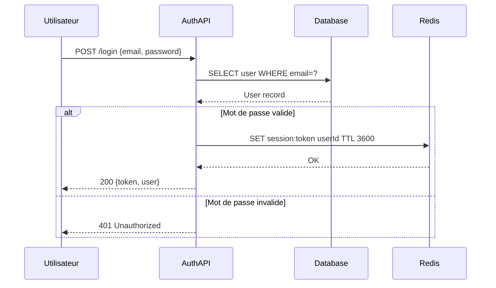

### Diagramme d'état Mermaid

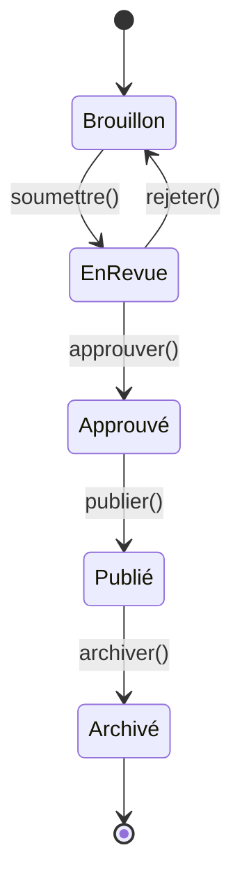

### Diagramme d'activité (flowchart) Mermaid

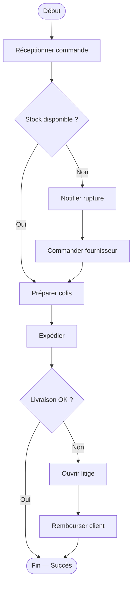

---

## Quand utiliser quel diagramme

| Question | Diagramme |
|----------|-----------|
| Quelles sont les entités et leurs relations ? | Classes |
| Comment les objets interagissent-ils dans un scénario ? | Séquence |
| Que fait le système pour ses utilisateurs ? | Cas d'utilisation |
| Comment se déroule un processus métier ? | Activité |
| Comment évolue l'état d'un objet ? | État |
| Comment les modules sont-ils assemblés ? | Composants |
| Sur quelle infrastructure tourne le système ? | Déploiement |

### Workflow de modélisation recommandé

```
1. Cas d'Utilisation     → "Que doit faire le système ?"
        ↓
2. Classes               → "Avec quelles entités ?"
        ↓
3. Séquence              → "Comment pour chaque scénario ?"
        ↓
4. État                  → "Cycle de vie des entités complexes ?"
        ↓
5. Activité              → "Détail des processus métier ?"
        ↓
6. Composants            → "Comment organiser le code ?"
        ↓
7. Déploiement           → "Sur quelle infrastructure ?"
```

> [!tip] Règle pratique
> Ne modéliser que ce qui apporte de la valeur. Un diagramme de classes à 50 entités est moins utile qu'un diagramme ciblé sur 5-10 entités clés. UML est un outil de communication — s'il ne facilite pas la conversation, il est trop détaillé.

---

## Exercices Pratiques

### Exercice 1 — Diagramme de classes : Application bancaire

Créez un diagramme de classes pour un système bancaire simple :
- Un `Client` peut avoir plusieurs `Comptes` (Courant, Épargne)
- Un `Compte` a un `solde`, une `dateOuverture`, et un `numero`
- `CompteEpargne` hérite de `Compte` et ajoute un `tauxInteret`
- Un `Compte` peut effectuer des `Virements` vers un autre `Compte`
- Un `Virement` a un `montant`, une `date`, une `description`
- `Banque` gère l'ensemble des comptes et clients

**À faire :** Dessiner le diagramme avec les bonnes multiplicités et types de relation (composition pour virement, agrégation pour compte dans banque, héritage pour épargne).

### Exercice 2 — Diagramme de séquence : Reset de mot de passe

Modélisez le flux de réinitialisation de mot de passe :
1. Utilisateur demande un reset avec son email
2. Système vérifie si l'email existe
3. Si oui : génère un token unique, l'enregistre en base avec expiration, envoie un email
4. Utilisateur clique le lien → système vérifie le token (valide ? expiré ?)
5. Si valide : affiche formulaire nouveau mot de passe
6. Utilisateur soumet → hachage + sauvegarde + invalidation du token

**Utiliser les fragments alt/opt.**

### Exercice 3 — Diagramme d'état : Ticket de support

Modélisez le cycle de vie d'un ticket de support :
- États : Ouvert, En cours, En attente client, Résolu, Fermé, Rouvert
- Transitions avec événements et gardes (ex : "Fermer [résolu depuis > 7 jours]")
- Ajouter un état composite pour "En cours" avec sous-états : "Assigné" et "EnAnalyse"

### Exercice 4 — Mermaid dans Obsidian

Créez ces diagrammes en Mermaid directement dans Obsidian :
1. Diagramme de classes : système de réservation d'hôtel (Hotel, Chambre, Reservation, Client)
2. Flowchart : algorithme de tri par sélection
3. Diagramme de séquence : ajout d'un article au panier e-commerce

### Exercice 5 — Architecture complète

Pour une application de gestion de tâches (type Trello) :
1. Cas d'utilisation : identifier les acteurs (Admin, User, Viewer) et les cas (créer carte, déplacer carte, inviter membre, etc.)
2. Classes : Board, Column, Card, User, Label, Attachment
3. Séquence : déplacer une carte entre colonnes (optimistic update + sync serveur)
4. Déploiement : déploiement cloud (CDN + Load Balancer + Backend + DB + Cache)

> [!tip] Ressources
> - PlantUML online : https://www.plantuml.com/plantuml
> - Mermaid Live Editor : https://mermaid.live
> - draw.io : https://app.diagrams.net

---

## Liens et Références

- [[03 - POO en Python]] — Classes et héritage Python en pratique
- [[01 - Introduction a Java]] — Classes et interfaces Java
- [[01 - Methodes Agiles Scrum et Kanban]] — Contexte d'utilisation d'UML en équipe Agile
- [[Architecture Logicielle/01 - Principes SOLID]] — Design patterns liés aux diagrammes de classes
